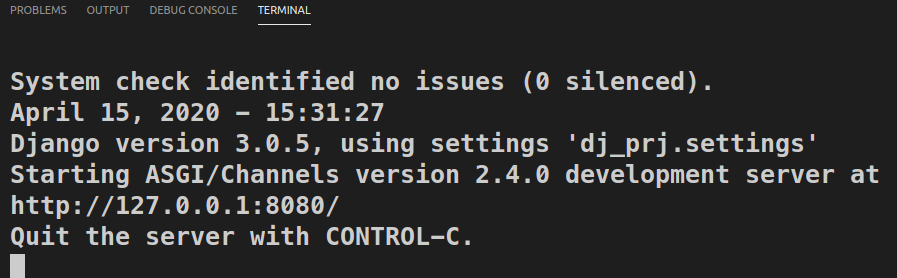

# Installing

    INSTALLED_APPS = (
        
        ...
        'channels',
    )

## Creating an application.

myproject/routing.py:

    from channels.routing import ProtocolTypeRouter

    application = ProtocolTypeRouter({
        # Empty for now (http->django views is added by default)
    })

## Defining global parameter.

    ASGI_APPLICATION = "myproject.routing.application"

## Create a consumer.

account/consumer.py

    import json
    from channels.generic.websocket import WebsocketConsumer

    class OnlineConsumer(WebsocketConsumer):
        def connect(self):
            print('websocket connecting')
            self.accept()

        def disconnect(self, close_code):
            pass

        def receive(self, text_data):
            text_data_json = json.loads(text_data)
            print(text_data_json)

## Create a routing.

    from django.urls import re_path

    from account.consumer import OnlineConsumer

    websocket_urlpatterns = [
        re_path(r'online/$', OnlineConsumer),
    ]

    from channels.auth import AuthMiddlewareStack
    from channels.routing import URLRouter

    application = ProtocolTypeRouter({
        # Empty for now (http->django views is added by default)
        'websocket': AuthMiddlewareStack(
            URLRouter(
                websocket_urlpatterns
            )
        ),
    })

## Client connection.

frontend/src/app/app.component.ts

    import { Component } from '@angular/core';

    @Component({
    selector: 'app-root',
    templateUrl: './app.component.html',
    styleUrls: ['./app.component.scss']
    })
    export class AppComponent {
    private socket;
        constructor() {
            this.socket = new WebSocket(`ws://localhost:8080/online/`);
        }
    }

## Send the message from Angular to server

    this.socket.send(JSON.stringify({...})

## Recive the message from server in angular app.

    this.socket.onmessage = event => {
       const message = JSON.parse(event.data);
       console.log(message);

      if (message.type === 'online') {
        do something ....
      }

## Send the message from server to angular app. Single connection.

    self.send(text_data={...})

## Broadcasting to the channels name.

    channel_layer = get_channel_layer()
    for c in UserOnline.objects.all():
        print('sending %s' % c.sid)
        async_to_sync(channel_layer.send)(
            c.sid,
            {
                'type': 'online.off',
                'message': 'chao-kakao'
            }
        )