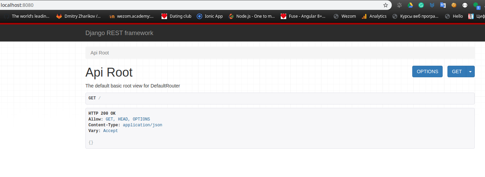

## Inclide in INSTALLED_APPS list.

    INSTALLED_APPS = [
        ...
        'rest_framework',
    ]

### urls.py

    from django.contrib import admin
    from django.urls import path, include
    from rest_framework import routers

    router = routers.DefaultRouter()

    urlpatterns = [
        path('',include(router.urls)),
        path('admin/', admin.site.urls),
    ]

