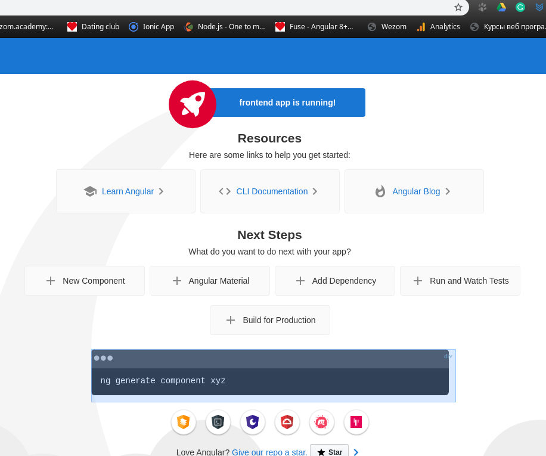

# Python

## Make a virtual environment
    mkdir backend
    cd backend 
    virtualenv -p python3 venv
    . ./venv/bin/activate

Small tip. Rewrite the cd func in the .bashrc file to activate VO automatically.

    cd () {
        builtin cd ${1:+"$@"} 
        if [ -d "venv" ]
    then
        source ./venv/bin/activate
        fi  
    }    

## Requirements.

requirements.txt

    Django==3.0.5
    djangorestframework==3.11.0
    channels==2.4.0
    django-filter==2.2.0
    djangochannelsrestframework==0.0.5

### Install command.

    pip install -r requirements.txt

### Start prodject.

    django-admin startproject dj_prj
    cd dj_prj

### Migration

    ./manage.py migrate

### Start dev server.

    ./manage.py runserver 8080

### .gitignore

    venv
    *.pyc
    __pycache__

# Angular.

    ng new frontend
    cd frontend
    ng serve --port 4201

