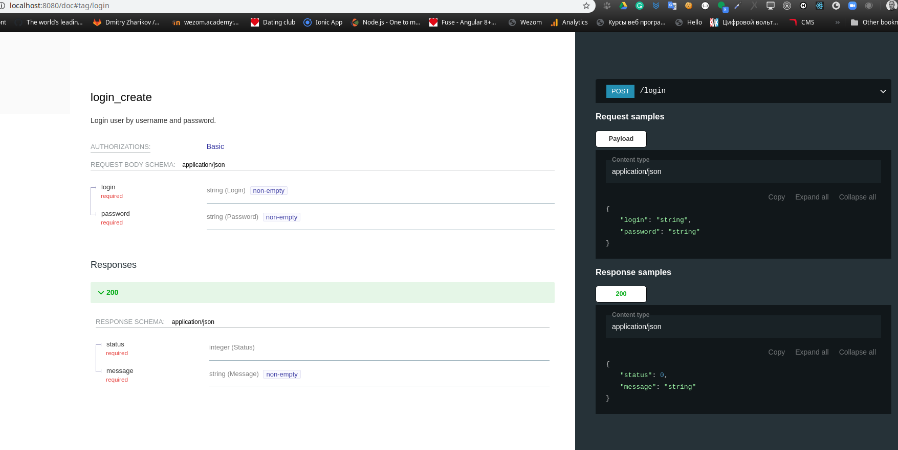
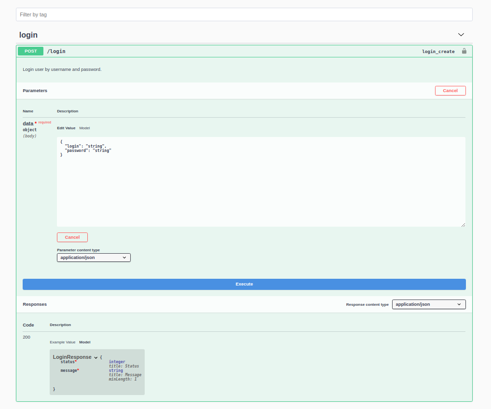

# Installation.

    pip install drf-yasg

## Include in settings.

    INSTALLED_APPS = [
    ...
    'drf_yasg',
    ...
    ]

### Create swagger routes.

    from rest_framework import permissions
    from drf_yasg.views import get_schema_view
    from drf_yasg import openapi

    schema_view = get_schema_view(
    openapi.Info(
        title="WEZOM vebinar API",
        default_version='v1',
        description=''' Documentation
        The `ReDoc` view can be found [here](/doc).
        ''',
        terms_of_service="https://www.google.com/policies/terms/",
        contact=openapi.Contact(email="zdimon77@gmail.com"),
        license=openapi.License(name="BSD License"),
    ),
    public=True,
    permission_classes=(permissions.AllowAny,),
    )

    urlpatterns = [
       ...
        # swagger
        path(r'swagger', schema_view.with_ui('swagger', cache_timeout=0), name='swagger-ui'),
        path(r'doc', schema_view.with_ui('redoc', cache_timeout=0), name='swagger-doc'),
    ]

### Add serializers by swagger_auto_schema decorator.

    from drf_yasg.utils import swagger_auto_schema

    class LoginView(APIView):
        '''
        
        Login view.

        '''

        permission_classes = (AllowAny,)
        serializer_class = LoginRequestSerializer
        @swagger_auto_schema( 
            operation_description="Login user by username and password.", \
            request_body=LoginRequestSerializer, \
            responses={200: LoginResponseSerializer} )
        def post(self, request, format=None):
            return Response(LoginResponseSerializer({'status': 0, 'message': 'ok'}).data)

### Getting POST parameters.

    request.data['password']