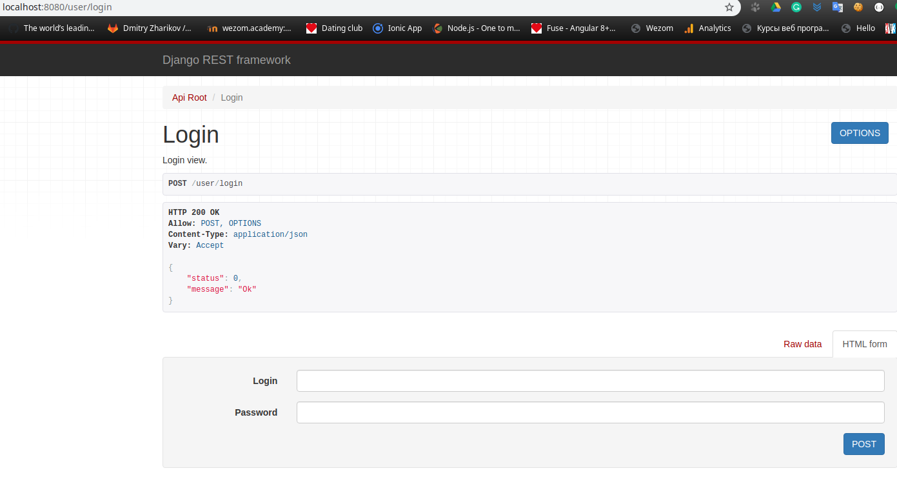

## Start a new app.

    ./manage.py startapp account

### Add the app to the settings.

    INSTALLED_APPS = [
        ...
        'account'
    ]

### Account model inherited from Django User model.

account/models.py

    from django.db import models

    from django.contrib.auth.models import User

    class UserProfile(User):
        GENDER = (
            ('male', 'Man'),
            ('female','Woman')
        )

        gender = models.CharField(
            verbose_name='Gender',
            choices=GENDER,
            db_index=True,
            default='male',
            max_length=6)

        firstname = models.CharField(default='', max_length=250)
        lastname = models.CharField(default='', max_length=250)

### Make and apply migrations.

    ./manage.py makemigrations
    ./manage.py migrate

### Registration view.

    from django.shortcuts import render

    from rest_framework.views import APIView
    from rest_framework.response import Response
    from rest_framework.permissions import IsAuthenticated, AllowAny

    class LoginView(APIView):
        '''
        
        Login view.

        '''

        permission_classes = (AllowAny,)

        def post(self, request, format=None):
            return(Response({'status': 0, 'message': 'Ok'}))

### Making a route to the single view.

urls.py

    from django.contrib import admin
    from django.urls import path, include
    from rest_framework import routers

    class RootRouter(routers.DefaultRouter):
        def get_api_root_view(self, api_urls=None):
            api_root_dict = {}
            api_root_dict['user-login'] = 'user-login'
            for prefix, viewset, basename in self.registry:
                api_root_dict[prefix] = prefix
            return self.APIRootView.as_view(api_root_dict=api_root_dict)

    router = RootRouter()

    from account.views import LoginView

    urlpatterns = [
        path('',include(router.urls)),
        path('user/login',LoginView.as_view(),name="user-login"),
        path('admin/', admin.site.urls),
    ]

### Add the request serializer.

    from rest_framework import serializers

    class LoginRequestSerializer(serializers.Serializer):
        login = serializers.CharField()
        password = serializers.CharField()

    class LoginView(APIView):
        ...
        serializer_class = LoginRequestSerializer
           

### Add the Response serializer.

    class LoginResponseSerializer(serializers.Serializer):
        status = serializers.IntegerField()
        message = serializers.CharField()

    class LoginView(APIView):
        ...
        def post(self, request, format=None):
            return Response(LoginResponseSerializer({'status': 0, 'message': 'ok'}).data)
            